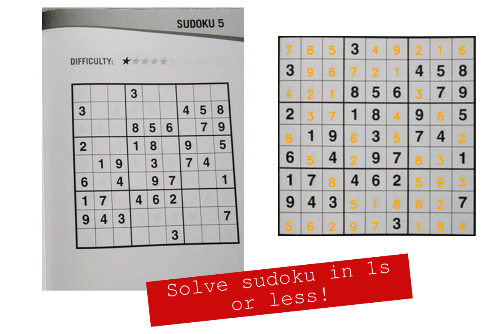

# SUDOKU AI
Sudoku solver using OpenCV, Tensorflow/Keras and a little bit magic.

## Demo
Want to impress your friends? You came to the right place ;)


## How to use?
### First clone this repo
```
git clone https://github.com/iamthaoly/sudoku-ai.git
```
- **Open the directory you had cloned in command line** 
 
### Install requirements
```
pip install -r requirements.txt
```

### Quick start with a sample image
```
python solve.py
```
### Solve your own puzzle
- **Copy your image to images folder**
```
python solve.py --image images/image_file_name.jpg

Tada! Solved puzzle has been saved at output folder.
```
## Todo
- [x] Save solved puzzle with custom name
- [x] No puzzle bug fix
- [ ] Webcam support
