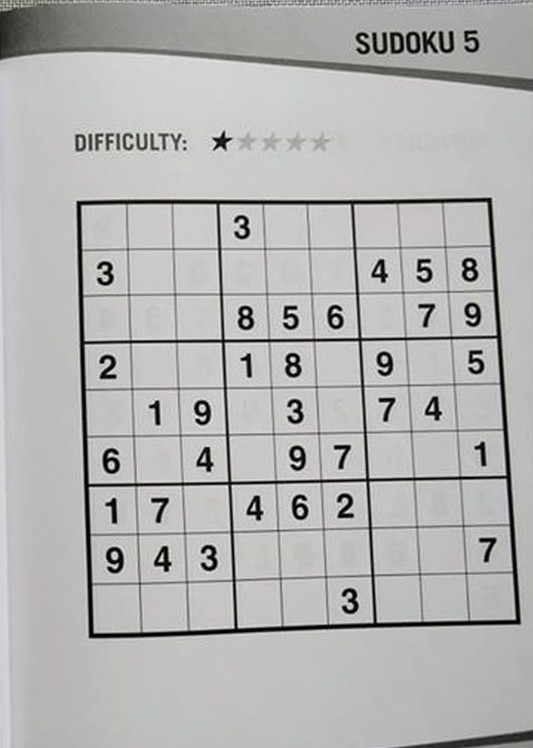
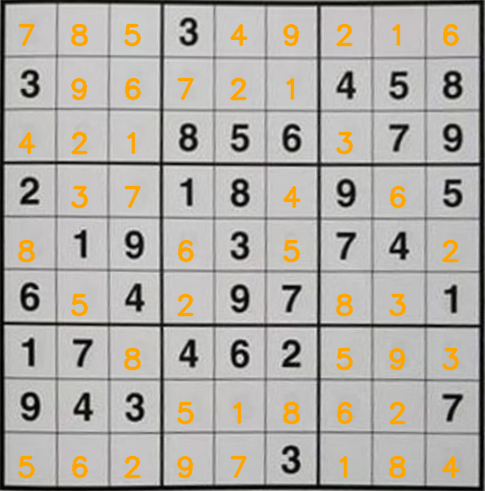

# 🧩 Sudoku AI

**Snap a photo. Run one command. Watch the grid fill itself.**

Sudoku AI hunts down the puzzle in your picture, reads the printed digits with a CNN, then **blasts through the solution** with Knuth’s Algorithm X (Dancing Links). Empty cells come back in orange on a clean, top-down view of the board.

No typing digits by hand. No staring at a half-finished newspaper. Just photo in, solved puzzle out.

<p align="center">
  
  &nbsp;
  
</p>

## ✨ Why this is fun

- 📷 Works from a **real photo** of a printed puzzle — not only a perfectly cropped screenshot
- 🔄 Perspective warp so the grid is read square-on, even if you shot it at an angle
- 🧠 Digit classification with a Keras CNN (`data/MNIST_keras_CNN.h5`)
- ⚡ Exact solver via **Algorithm X** — about **11–26× faster** than naive backtracking on everyday boards
- 🔍 Debug mode to peek at every vision step
- 💾 Solved image dropped into `output/` using your input filename

## ⚡ Algorithm X vs backtracking

Backtracking guesses cell by cell. Fine for a coffee-break puzzle… until the search tree explodes.

Algorithm X models Sudoku as an **exact cover** problem and always picks the most constrained column first (Dancing Links). The exact-cover matrix is built **once**, then every solve is just “drop in the clues and search.” `solve.py` times that search, not the setup.

Median of 20 runs (3 warmup):

| Puzzle | Backtracking | Algorithm X | Speedup |
| --- | ---: | ---: | ---: |
| Classic easy grid | 22 ms | 0.9 ms | **~26×** |
| Sample photo board (`images/1.jpg`) | 9 ms | 0.8 ms | **~11×** |
| Hard (Arto Inkala) | 275 ms | 48 ms | **~6×** |

Building the matrix itself is under **1 ms**. That is why `solve.py` ships Algorithm X. The classic backtracker is still in `source/Sudoku/backtracking.py` if you want to race them yourself.

## 🪄 How it works

```
photo → find grid → warp to 9×9 → extract digits → CNN → Algorithm X → overlay solution
```

1. **Locate the puzzle** — grayscale, blur, adaptive threshold, then the largest 4-sided contour.
2. **Warp** — four-point perspective transform for a bird’s-eye board.
3. **Read cells** — each cell is cropped, borders cleared, and empty cells skipped.
4. **Classify** — non-empty cells are resized to 28×28 and classified by the CNN.
5. **Solve** — the 9×9 grid becomes an exact-cover problem and Algorithm X finishes it off.
6. **Render** — only originally empty cells are drawn onto the warped puzzle image.

## 📦 Requirements

- Python 3.6–3.8 (TensorFlow 2.3)
- Dependencies in `requirements.txt`:

```
opencv-python==4.4.0.40
tensorflow==2.3.0
keras==2.4.3
imutils==0.5.3
scikit-image==0.18
```

A pretrained digit classifier is already in the repo at `data/MNIST_keras_CNN.h5` — no training marathon required.

## 🚀 Install

```bash
git clone https://github.com/iamthaoly/sudoku-ai.git
cd sudoku-ai
python3 -m venv .venv
source .venv/bin/activate   # Windows: .venv\Scripts\activate
pip install -r requirements.txt
```

## 🎯 Usage

Solve the sample puzzle (`images/1.jpg`) and get that first “whoa” moment:

```bash
python solve.py
```

Then throw **your** photo at it (copy it into `images/` first, or pass any path):

```bash
python solve.py --image images/your_puzzle.jpg
```

The result is saved as `output/<same_basename>.png`

### Options

| Flag | Default | Description |
| --- | --- | --- |
| `-i`, `--image` | `images/1.jpg` | Path to the puzzle photo |
| `-m`, `--model` | `data/MNIST_keras_CNN.h5` | Path to the digit CNN |
| `-d`, `--debug` | `-1` | Set to `1` to show each vision step |

```bash
python solve.py --image images/2.jpg --debug 1
```

## 🗂️ Project layout

```
sudoku-ai/
├── solve.py                 # CLI: load image, classify, solve, write output
├── requirements.txt
├── data/
│   └── MNIST_keras_CNN.h5   # pretrained digit classifier
├── images/                  # sample inputs
├── output/                  # solved images
└── source/
    ├── models/
    │   └── Sudokunet.py     # CNN architecture
    └── Sudoku/
        ├── puzzle.py        # grid detection and digit extraction
        ├── x_algo.py        # Algorithm X / exact cover solver
        └── backtracking.py  # backtracking solver (standalone)
```

## 📸 Tips for better photos

- Include the **full square grid**. A slight angle is fine; a torn or cropped edge is not.
- Prefer even lighting and a focused shot of printed digits.
- Handwritten puzzles and unusual fonts are harder for the MNIST-trained model — printed newspaper/book puzzles are its happy place.

## 🗺️ Roadmap

- [x] Save the solved puzzle using the input filename
- [x] Handle images with no detectable puzzle

## 📚 References

- [OpenCV Sudoku Solver and OCR](https://www.pyimagesearch.com/2020/08/10/opencv-sudoku-solver-and-ocr/)
- [Knuth, Dancing Links](https://arxiv.org/pdf/cs/0011047.pdf)
- [Algorithm X with dictionaries in Python](https://www.cs.mcgill.ca/~aassaf9/python/algorithm_x.html)
- [Analysis of Sudoku Solving Algorithms](http://www.enggjournals.com/ijet/docs/IJET17-09-03-043.pdf)

## 📄 License

